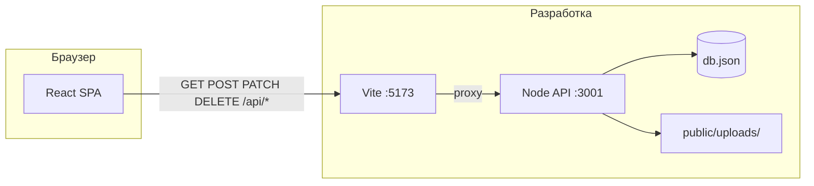
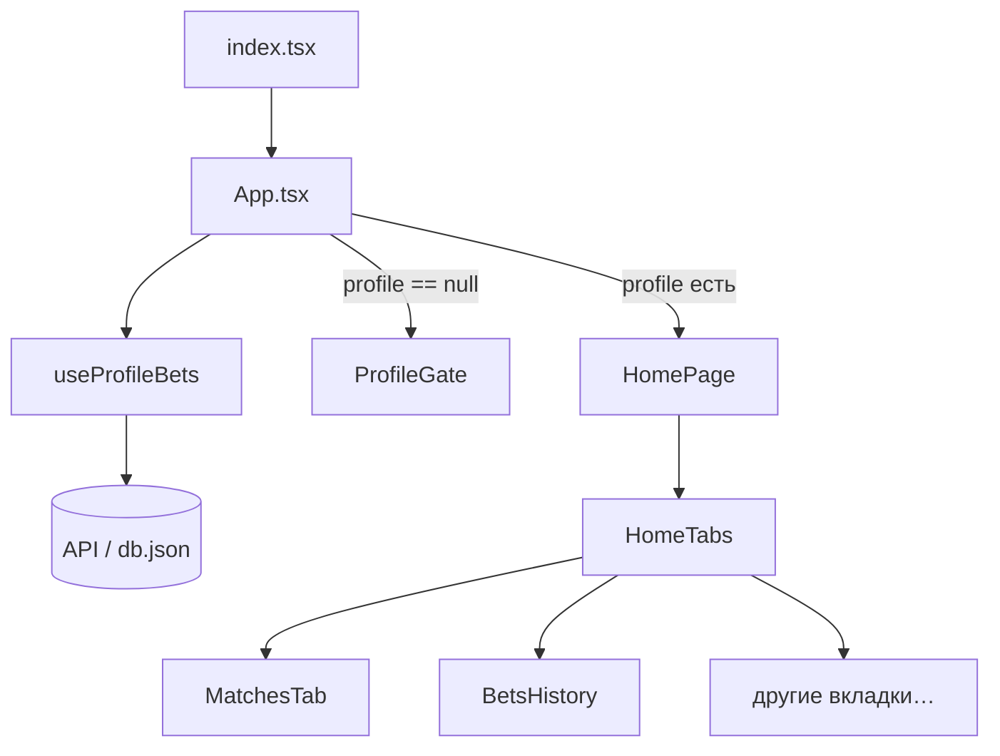

# 2. Архитектура

## 2.1. Общая схема

Приложение состоит из **двух процессов**, которые работают одновременно:



### Как проходит запрос (пример: загрузка ставок)

1. Пользователь открыл сайт → React вызвал `useProfileBets`.
2. Хук делает `httpClient.get("/bets?profileId=1")`.
3. Axios шлёт запрос на `http://localhost:5173/api/bets?profileId=1`.
4. Vite **проксирует** его на `http://localhost:3001/bets?profileId=1`.
5. json-server читает массив `bets` из `db.json`, фильтрует по `profileId`, отдаёт JSON.
6. React сохраняет данные в `useState` и рисует интерфейс.

Прокси настроен в `vite.config.ts`:

```ts
server: {
  proxy: {
    '/api': {
      target: 'http://localhost:3001',
      changeOrigin: true,
      rewrite: (path) => path.replace(/^\/api/, ''),
    },
  },
},
```

HTTP-клиент (`src/shared/api/httpClient.ts`):

```ts
export const httpClient = axios.create({ baseURL: "/api" });
```

---

## 2.2. Дерево проекта (верхний уровень)

```
FreedomBets/
├── db.json              # База данных (JSON-файл)
├── index.html           # HTML-оболочка для React
├── package.json         # Зависимости и npm-скрипты
├── vite.config.ts       # Настройки Vite + прокси + алиас @/
├── tsconfig.app.json    # Настройки TypeScript для src/
├── server/
│   ├── index.mjs        # Точка входа API
│   └── pickemFiles.mjs  # Сохранение картинок Pick'em на диск
├── scripts/             # Вспомогательные скрипты (миграции)
├── vite-plugins/        # Плагины Vite (manifest для major-логотипов)
├── public/              # Статика: логотипы команд, uploads, logo.png
├── src/                 # Исходный код React-приложения
└── docs/                # Эта документация
```

### `public/` — что лежит на диске и отдаётся как файл

| Путь | Назначение |
|------|------------|
| `public/logo.png` | Логотип приложения |
| `public/teams/` | Логотипы команд (по имени файла) |
| `public/orgs/` | Логотипы организаторов турниров |
| `public/majors/` | Логотипы Major-турниров + `manifest.json` |
| `public/uploads/pickems/` | Загруженные скриншоты Pick'em |
| `public/links/` | Иконки ссылок в шапке |

---

## 2.3. Структура `src/` (Feature-Sliced Design, упрощённо)

Код организован по **слоям**. Чем ниже слой — тем «базовее» код, меньше зависимостей от UI.

```
src/
├── index.tsx              # Точка входа: ReactDOM.createRoot → <App />
├── app/
│   ├── App.tsx            # Корневой компонент, useProfileBets
│   ├── providers/         # MUI ThemeProvider, глобальные стили
│   ├── theme/             # Тема MUI (цвета, типографика)
│   └── styles/            # GlobalStyles (styled-components)
├── pages/
│   └── HomePage/          # Главная страница после выбора профиля
├── layouts/
│   ├── AppLayout/         # Шапка, логотип, пасхалка
│   └── ProfileHeader/     # Блок профиля в шапке (баланс, выход)
├── features/              # Бизнес-функции по доменам
│   ├── bets/              # Ставки: форма, история, расчёты
│   ├── matches/           # Матчи: карточки, форма, привязка ставок
│   ├── events/            # Турниры (event), Major-статистика
│   ├── profile/           # Профили, хук useProfileBets, рейтинг
│   ├── pickem/            # Pick'em и медали
│   ├── teams/             # Статистика по командам
│   ├── summary/           # Вкладка «Статистика»
│   └── home/              # HomeTabs — переключатель вкладок
├── entities/              # Типы и чистые функции сущностей
│   ├── bet/
│   ├── match/
│   ├── profile/
│   ├── event/
│   ├── eventRecord/
│   ├── pickem/
│   └── medal/
└── shared/                # Переиспользуемое без бизнес-логики
    ├── api/               # httpClient (axios)
    ├── lib/               # Даты, логотипы, парсеры
    ├── styles/            # breakpoints
    └── ui/                # PageLoader, TeamLogo, OrganizationLogo…
```

### Правило импортов (упрощённо)

- `entities` **не импортирует** `features`.
- `features` может импортировать `entities` и `shared`.
- `pages` собирает `features` в экраны.
- Алиас `@/` = `src/` (настроен в `tsconfig` и `vite.config`).

Пример: `import type { Bet } from "@/entities/bet"`.

---

## 2.4. Поток данных на главном экране



### `useProfileBets` — центральный хук

Файл: `src/features/profile/hooks/useProfileBets.ts`

Он:

1. Хранит `activeProfileId` (из `localStorage`).
2. При смене профиля загружает данные параллельно (`Promise.all`).
3. Отдаёт в UI функции: `addBet`, `settleWin`, `addMatch`, …
4. После мутаций обновляет локальный `useState` и при необходимости патчит профиль (баланс, винрейт).

**Два списка ставок:**

| Переменная | Откуда | Зачем |
|------------|--------|-------|
| `bets` | `GET /bets?profileId=X` | История, статистика, формы — только текущий профиль |
| `allBets` | `GET /bets` | Матчи (ставки всех), Топ, Команды |

---

## 2.5. Сервер (`server/index.mjs`)

Сервер — это **обёртка** над json-server плюс кастомные маршруты.

### Стандартные REST-маршруты (json-server)

Для каждой **корневой** коллекции в `db.json` автоматически:

| Метод | URL | Действие |
|-------|-----|----------|
| GET | `/profiles` | Список |
| GET | `/profiles/:id` | Один элемент |
| POST | `/profiles` | Создать |
| PATCH | `/profiles/:id` | Частичное обновление |
| DELETE | `/profiles/:id` | Удалить |

То же для `bets`, `matches`, `pickems`, `medals`, `events`.

Фильтрация query-параметрами (json-server):  
`GET /bets?profileId=1` → только ставки с `profileId === 1`.

### Кастомные маршруты

| Метод | URL | Назначение |
|-------|-----|------------|
| POST | `/pickems/:id/stage-image` | Загрузка картинки стадии (multipart/form-data) |
| DELETE | `/uploads/pickems/:pickemId` | Удаление папки с файлами Pick'em |

### Статика

json-server настроен с `static: ["public"]`, поэтому  
`http://localhost:3001/uploads/pickems/9439/stage-1.jpg` отдаёт файл с диска.

### Hot-reload базы

В dev-режиме `chokidar` следит за `db.json`: если вы отредактировали файл вручную, сервер перечитает его (кроме момента собственной записи).

---

## 2.6. Сборка фронтенда

```
npm run build
  → tsc -b          # проверка типов TypeScript
  → vite build      # бандл в dist/
```

Vite-плагин `majorsManifestPlugin` генерирует `public/majors/manifest.json` из файлов в папке majors (для подстановки логотипов турниров).

---

## 2.7. Технологии и зачем они

| Технология | Роль в проекте |
|------------|----------------|
| **React** | UI из компонентов, реактивное обновление при смене данных |
| **TypeScript** | Типы для ставок, матчей — меньше ошибок при рефакторинге |
| **Vite** | Быстрый dev-сервер, HMR (обновление без перезагрузки страницы) |
| **MUI** | Готовые компоненты: Tabs, Dialog, TextField, Table |
| **styled-components** | CSS-in-JS для кастомного дизайна карточек матчей, вкладок |
| **Axios** | HTTP-запросы к API |
| **json-server** | REST API из JSON без написания CRUD вручную |
| **lowdb** | Атомарная запись в `db.json` |
| **multer** | Приём файлов при загрузке Pick'em |

---

Далее: [База данных и API →](03-baza-dannykh-i-api.md)
