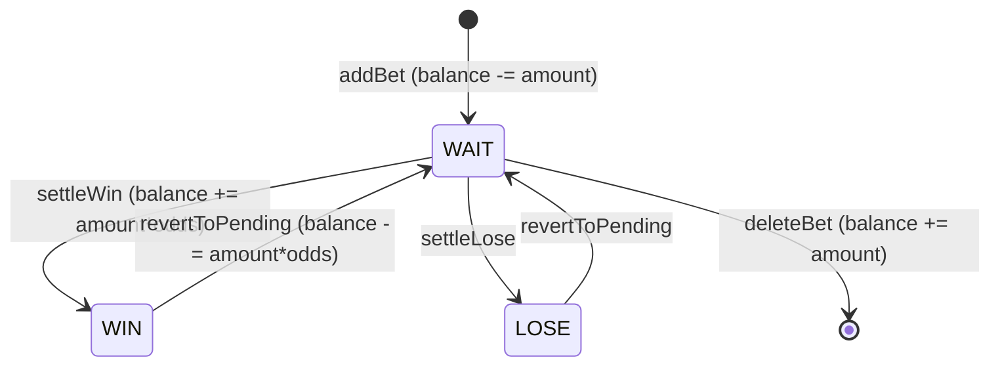

# 5. Функциональность приложения

## 5.1. Профили

### Создание

1. Пользователь вводит имя на `ProfileGate`.
2. `createProfile` вычисляет следующий свободный ID (`getNextProfileId`).
3. `POST /profiles` с начальным балансом 0.
4. Профиль сразу выбирается как активный.

### Удаление

`deleteProfile` в `useProfileBets`:

- Удаляет **все** ставки профиля.
- Удаляет pick'em (и файлы в `uploads/pickems/`).
- Удаляет медали и event records.
- Удаляет сам профиль.
- Сбрасывает активную сессию.

### Шапка профиля (`ProfileHeader`)

- Показ баланса.
- Редактирование имени.
- Ручная установка баланса (диалог).
- Выход из профиля (не удаление).
- Удаление профиля (с подтверждением).

---

## 5.2. Ставки

### Типы рынков (`betMarket`)

| Код | UI-название | Когда используется |
|-----|-------------|-------------------|
| `match` | Победа в матче | Ставка на исход всей серии |
| `map` | Победа на карте | Нужен `mapNumber` (1…N по формату) |
| `pistol` | Пистолетный раунд | `mapNumber` + `pistolRound` (1 или 2) |

Форматы и число карт: `MATCH_FORMAT_META` в `entities/bet/constants.ts`.

### Статусы

| Статус | UI | Смысл |
|--------|-----|-------|
| `WAIT` | В игре | Ставка не рассчитана |
| `WIN` | Выигрыш | Профит зачислен на баланс |
| `LOSE` | Проигрыш | Сумма уже списана при создании |

### Создание ставки

Пути:

1. Кнопки команд под карточкой матча.
2. (Убрано из шапки) ранее была «Новая ставка» — сейчас только через матч или историю/редактирование.

`BetFormDialog`:

- Проверяет, хватает ли `balance` на `amount`.
- При submit вызывает `addBet` → `POST /bets` с `profileId` текущего профиля.

### История (`BetsHistory`)

Таблица ставок **текущего профиля** с фильтрами и колонками: дата, турнир, команды, тип, сумма, кэф, результат, статус.

**ActionButtons** — WIN / LOSE / откат / удалить / редактировать (для WAIT).

### Расчёты

`src/features/bets/lib/calculations/basic.ts`:

```ts
// Профит только по рассчитанным ставкам
calcSettledProfit(bets)
// WIN: amount * odds - amount
// LOSE: -amount

// Винрейт
calcWinRate(bets)  // % WIN среди WIN+LOSE

// Сумма в открытых ставках
calcPendingExposure(bets)
```

---

## 5.3. Матчи

### Назначение

Матчи — **общий календарь** игр. Admin создаёт матч; любой пользователь может сделать на него ставку.

### Карточка матча (`MatchCard`)

Показывает:

- турнир (логотип организатора, название);
- дату, время, формат, стадию Major;
- две команды и счёт (если есть);
- статус «Скоро» / «Завершён».

`getMatchEffectiveStatus` может переводить `scheduled` → `finished` по времени (обновление раз в минуту через `statusClock`).

### Ставки под матчем

`findBetsForMatch` (`features/matches/lib/findBetsForMatch.ts`) связывает ставку и матч, если совпадают:

| Критерий | Примечание |
|----------|------------|
| `date` | Точное совпадение |
| `format` | BO1/BO3/BO5 |
| `eventOrganization`, `eventName` | Без учёта регистра, trim |
| `majorStage` | Включая `null` |
| Команды | Порядок может быть обратным |

**Время (`time`) не сравнивается** — ставка и матч могут иметь разное время в один день.

Отображаются ставки из **`allBets`** (все профили). У каждой строки — имя профиля; свои ставки подсвечены.

### Действия

- Любой пользователь: кнопки «ставка на команду 1/2».
- Admin: редактирование и удаление матча; кнопка «Изменить» у WAIT-ставок.

---

## 5.4. Турниры

### Tier

| Tier | Где в UI |
|------|----------|
| `Small` | Вкладка «Турниры» |
| `Big` | Вкладка «Турниры» |
| `Major` | Вкладка «Major» |

### `EventStats`

Группирует ставки профиля по паре `(eventOrganization, eventName)`, считает метрики, показывает карточки турниров.

Admin может редактировать турнир (даты, tier) → `updateEvent` обновляет связанные ставки и матчи с тем же турниром.

### Major-стадии

`MAJOR_STAGES`: Stage 1, Stage 2, Stage 3, Playoff.

Для Major-ставок заполняется `majorStage`. `MajorEventStats` группирует по стадиям.

---

## 5.5. Вкладка «Топ» (`ProfileRankingTab`)

`buildProfileRankings(profiles, allBets)`:

1. Группирует ставки по `profileId`.
2. **Исключает admin-профиль** из рейтинга.
3. Считает: число ставок, винрейт, профит.
4. Сортирует по профиту (убывание).

UI: подиум для топ-3 + список остальных.

---

## 5.6. Вкладка «Команды» (`TeamsTab`)

`calcTeamStatsList(allBets)` — статистика по каждой команде по **всем** ставкам всех профилей (на кого ставили, винрейт, профит).

---

## 5.7. Вкладка «Статистика» (`StatsSummary`)

Сводные метрики по ставкам **текущего профиля**: общий профит, винрейт, exposure, разбивки.

---

## 5.8. Pick'em

Личный архив прогнозов на Major:

1. Добавить Major (выбор из существующих турниров в ставках).
2. Для каждой стадии загрузить скриншот (`POST stage-image`).
3. Отметить результат стадии: «Сыграл» / «Не сыграл».

Картинки на диске: `public/uploads/pickems/{pickemId}/`.

`PickemImageLightbox` — просмотр в полноэкранном режиме.

---

## 5.9. Медали

Привязаны к **профилю** (`profileId`). Хранятся как base64 в `db.json` (поле `imageData`).

Отображаются на вкладке Pick'em в `PickemMedalsBlock`. Загрузка через input file → `uploadMedal`.

---

## 5.10. Права администратора

Функция `isAdminProfile(profile)` (`features/profile/lib/isAdminProfile.ts`):

```ts
profile.role === "admin"
// ИЛИ
profile.name.trim().toLowerCase() === "admin"
```

### Что видит только admin

| Элемент | Файл |
|---------|------|
| «Новый матч», «Новый турнир» | `HomeQuickActions` |
| Редактирование / удаление матча | `MatchCard` |
| Редактирование турнира | `EventStats`, `MajorEventStats` |
| «Изменить» у WAIT-ставки в матче | `MatchRelatedBets` |

Обычный пользователь видит матчи и **все** ставки под ними, но не управляет расписанием.

### Как сделать admin

В `db.json` у профиля:

```json
{
  "id": "3",
  "name": "admin",
  "role": "admin",
  ...
}
```

Или просто имя `admin` без `role`.

---

## 5.11. Пасхалка логотипа

Клик по логотипу в шапке → `LogoClickToast` со случайной фразой из `logoClickMessages.ts`.

---

## 5.12. Связь ставки и матча (частые вопросы)

**Ставка не появилась под матчем?** Проверьте:

1. Совпадает ли **дата** (`YYYY-MM-DD`).
2. Совпадает ли **формат** (BO3 vs BO1).
3. Тот же **турнир** (организатор + название, без лишних пробелов).
4. Те же **команды** (регистр не важен).
5. Совпадает ли **majorStage** (оба `null` для не-Major).

**Ставка другого профиля не видна?** После обновления должна быть видна всем — используется `allBets`. Обновите страницу, если данные устарели.

---

## 5.13. Диаграмма жизненного цикла ставки



---

Далее: [Разработка →](06-razrabotka.md)
